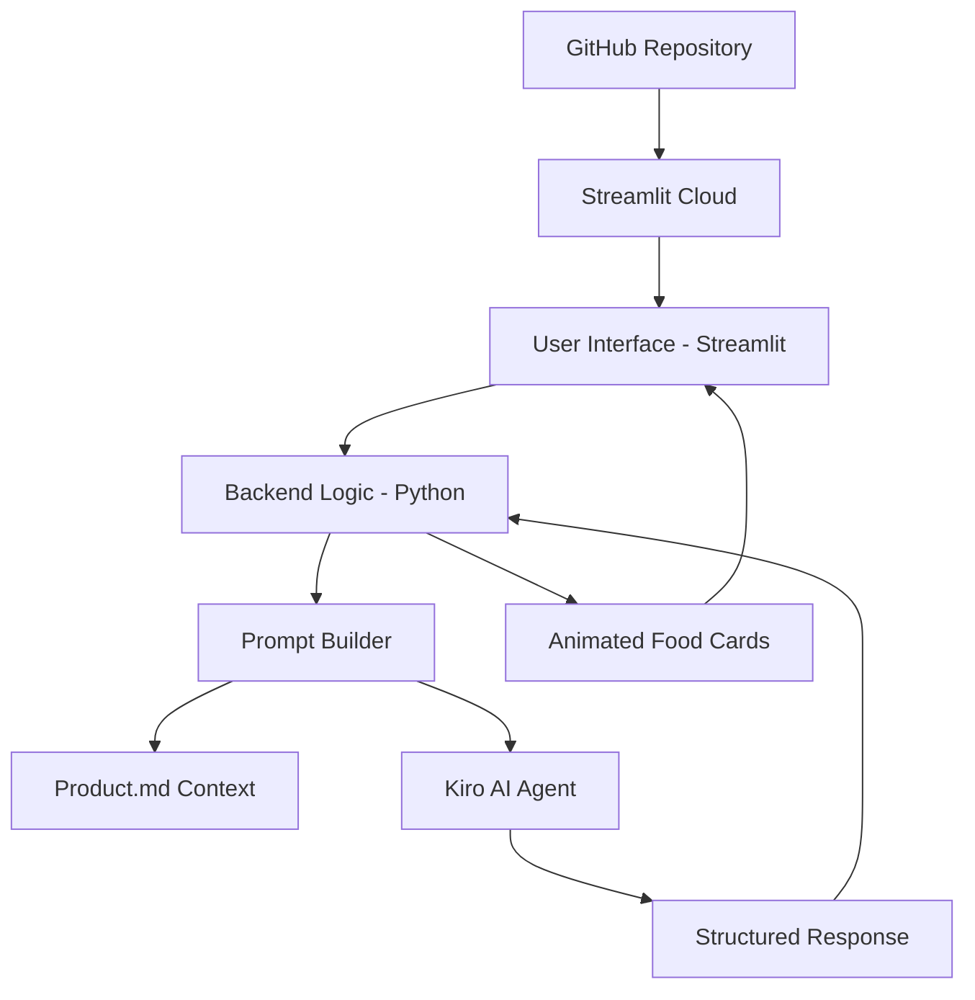

# Design Document: Delhi Street Food Recommender App

## Overview

The Delhi Street Food Recommender App is a Python-based Streamlit application that provides authentic, local-style street food recommendations using custom context from a product.md knowledge base. The app integrates with Kiro AI to deliver personalized recommendations that feel like they come from a local Delhi expert rather than generic AI responses.

The system follows a simple architecture: Streamlit frontend → Python backend → Kiro AI agent → structured local recommendations. The entire application is designed for easy deployment on Streamlit Cloud via GitHub integration.

## Architecture



### Component Flow
1. **User Input**: Area selection, time preference, food type, budget
2. **Context Loading**: Read product.md file containing local Delhi knowledge
3. **Prompt Construction**: Combine user query with local context
4. **AI Processing**: Send structured prompt to Kiro agent
5. **Response Parsing**: Extract recommendations from Kiro response
6. **UI Rendering**: Display animated food cards with local tips

## Components and Interfaces

### Frontend Components (Streamlit)

#### Main Interface (`app.py`)
- **Area Selector**: Dropdown with Delhi localities from product.md
- **Time Selector**: Radio buttons (Morning, Afternoon, Evening, Late Night)
- **Food Preference Input**: Text input for specific cravings or dietary needs
- **Budget Selector**: Slider or radio buttons (Budget-friendly, Mid-range, Premium)
- **Find Street Food Button**: Triggers recommendation generation
- **Results Container**: Dynamic area for displaying food cards

#### Food Card Component
```python
def render_food_card(recommendation):
    """
    Renders an animated food card with:
    - Food name and emoji
    - Location details
    - Price range in ₹
    - Crowd timing info
    - Local tips
    - Hover animations
    """
```

#### Styling System
- **CSS Injection**: Custom CSS via `st.markdown()` with `unsafe_allow_html=True`
- **Gradient Background**: Delhi street food inspired color scheme
- **Card Animations**: CSS transitions for hover effects and slide-in animations
- **Responsive Design**: Mobile-friendly layout using Streamlit columns

### Backend Components

#### Recommendation Engine (`recommendation_engine.py`)
```python
class RecommendationEngine:
    def __init__(self):
        self.context_loader = ContextLoader()
        self.prompt_builder = PromptBuilder()
        self.kiro_client = KiroClient()
    
    def get_recommendations(self, user_query):
        """Main orchestration method"""
        context = self.context_loader.load_product_context()
        prompt = self.prompt_builder.build_prompt(context, user_query)
        response = self.kiro_client.query(prompt)
        return self.parse_response(response)
```

#### Context Loader (`context_loader.py`)
```python
class ContextLoader:
    def load_product_context(self):
        """Reads and parses product.md file"""
        # Load markdown content
        # Parse area information
        # Extract food data, prices, timings
        # Return structured context dict
```

#### Prompt Builder (`prompt_builder.py`)
```python
class PromptBuilder:
    def build_prompt(self, context, user_query):
        """
        Constructs Kiro prompt with:
        - System instructions (behave like local Delhi expert)
        - Complete product.md context
        - User query (area, time, preferences)
        - Response format requirements
        """
```

#### Kiro Client (`kiro_client.py`)
```python
class KiroClient:
    def query(self, prompt):
        """
        Sends prompt to Kiro AI agent
        Handles API communication
        Returns structured response
        """
```

### Data Models

#### User Query Model
```python
@dataclass
class UserQuery:
    area: str
    time_preference: str  # Morning, Afternoon, Evening, Late Night
    food_preferences: str  # Free text input
    budget_category: str  # Budget-friendly, Mid-range, Premium
```

#### Recommendation Model
```python
@dataclass
class FoodRecommendation:
    food_name: str
    location: str
    price_range: str  # e.g., "₹70-90"
    crowd_info: str   # e.g., "High after 6 PM"
    local_tip: str    # e.g., "Avoid metro exit carts"
    hygiene_rating: str  # Green/Yellow/Red signal
```

#### Response Model
```python
@dataclass
class RecommendationResponse:
    area: str
    recommendations: List[FoodRecommendation]
    alternative_areas: List[str]  # If no results in requested area
    local_context: str  # Additional local insights
```

## Correctness Properties

*A property is a characteristic or behavior that should hold true across all valid executions of a system-essentially, a formal statement about what the system should do. Properties serve as the bridge between human-readable specifications and machine-verifiable correctness guarantees.*

### Property Analysis

Before defining properties, let me analyze the acceptance criteria from the requirements:

<function_calls>
<invoke name="prework">
<parameter name="featureName">delhi-street-food-app

## Correctness Properties

*A property is a characteristic or behavior that should hold true across all valid executions of a system-essentially, a formal statement about what the system should do. Properties serve as the bridge between human-readable specifications and machine-verifiable correctness guarantees.*

Based on the prework analysis, I've identified the following testable properties after eliminating redundancy:

### Property Reflection

After reviewing all testable criteria, I've consolidated related properties to avoid redundancy:
- Properties 1.2 and 1.4 (AI knowledge restriction) are combined into Property 1
- Properties 3.1 and 1.3 (prompt construction) are combined into Property 2  
- Properties 5.2 and 3.3 (response structure) are combined into Property 3
- Properties 5.4 and 2.4 (input validation) are combined into Property 4

### Core Properties

**Property 1: AI Knowledge Restriction**
*For any* user query about areas or foods not present in Product_Context, the system should return appropriate "not available" responses and never provide recommendations from external knowledge sources
**Validates: Requirements 1.2, 1.4**

**Property 2: Complete Context Injection**
*For any* user query, the generated prompt sent to Kiro should contain the complete Product_Context content along with the user's specific preferences
**Validates: Requirements 1.3, 3.1**

**Property 3: Response Structure Completeness**
*For any* valid recommendation returned by the system, it should contain all required fields: food name, location, price range, crowd information, and local tips
**Validates: Requirements 3.3, 5.2**

**Property 4: Input Validation Consistency**
*For any* combination of missing or invalid input parameters (area, time, preferences), the system should validate all required fields and return meaningful error messages
**Validates: Requirements 2.4, 5.4**

**Property 5: Context Loading Integrity**
*For any* valid product.md file, the loaded context should contain all required data categories: Delhi areas, street food options, prices, peak hours, and hygiene notes
**Validates: Requirements 1.1, 7.2**

**Property 6: Area Selector Synchronization**
*For any* areas defined in Product_Context, the UI area selector should contain exactly those areas and no others
**Validates: Requirements 2.1**

**Property 7: Context Hot Reloading**
*For any* modification to the Product_Context file, the next query should use the updated information without requiring application restart
**Validates: Requirements 1.5, 7.5**

**Property 8: Fallback Recommendation Behavior**
*For any* query requesting recommendations from an area with no suitable options, the system should provide alternative suggestions from nearby areas
**Validates: Requirements 3.5**

**Property 9: Food Card Rendering**
*For any* recommendation displayed in the UI, it should be rendered as a card component with emoji enhancement
**Validates: Requirements 4.2, 4.4**

**Property 10: Error Handling Robustness**
*For any* malformed Product_Context file or system error condition, the system should provide clear, meaningful error messages
**Validates: Requirements 5.5, 7.4**

## Error Handling

### Context Loading Errors
- **Missing product.md**: Display clear error message with setup instructions
- **Malformed markdown**: Parse errors with line number information
- **Empty context**: Warning about insufficient data for recommendations

### AI Integration Errors
- **Kiro API failures**: Graceful fallback with cached responses or error message
- **Malformed AI responses**: Response parsing with error recovery
- **Rate limiting**: User-friendly messages about temporary unavailability

### User Input Errors
- **Invalid area selection**: Validation with suggested alternatives
- **Empty preferences**: Prompt for minimum required information
- **Unsupported time slots**: Default to nearest available option

### UI Error States
- **Loading states**: Progress indicators during AI processing
- **Empty results**: Helpful suggestions for alternative queries
- **Network issues**: Offline mode indicators and retry options

## Testing Strategy

### Dual Testing Approach
The system will use both unit testing and property-based testing for comprehensive coverage:

**Unit Tests**: Focus on specific examples, edge cases, and integration points
- Test specific area/time combinations with known expected results
- Test UI component rendering with sample data
- Test error conditions with malformed inputs
- Test integration between components

**Property-Based Tests**: Verify universal properties across all inputs using Hypothesis (Python property-based testing library)
- Generate random user queries and validate response structure
- Test context loading with various markdown file formats
- Validate prompt construction across different input combinations
- Test error handling with randomly generated invalid inputs

### Property Test Configuration
- **Minimum 100 iterations** per property test to ensure thorough coverage
- **Test tagging**: Each property test tagged with format: **Feature: delhi-street-food-app, Property {number}: {property_text}**
- **Hypothesis integration**: Use Hypothesis library for generating test data and managing test execution

### Testing Framework Selection
- **Unit Testing**: pytest for Python unit tests
- **Property Testing**: Hypothesis library for property-based testing
- **UI Testing**: Streamlit testing utilities for component validation
- **Integration Testing**: End-to-end tests using Streamlit app testing framework

The combination of unit and property tests ensures both concrete functionality validation and comprehensive input space coverage, providing confidence in system correctness across all usage scenarios.

## Deployment Architecture

### Streamlit Cloud Integration
- **GitHub Repository**: Source code hosted on GitHub with automatic deployment triggers
- **Dependencies**: requirements.txt with all Python packages (streamlit, requests, markdown, etc.)
- **Configuration**: .streamlit/config.toml for app settings and styling
- **Secrets Management**: Streamlit secrets for Kiro API credentials

### File Structure
```
delhi-street-food-app/
├── app.py                    # Main Streamlit application
├── recommendation_engine.py  # Core recommendation logic
├── context_loader.py        # Product.md file handling
├── prompt_builder.py        # Kiro prompt construction
├── kiro_client.py           # Kiro API integration
├── product.md               # Local Delhi knowledge base
├── requirements.txt         # Python dependencies
├── .streamlit/
│   └── config.toml          # Streamlit configuration
└── tests/
    ├── test_unit.py         # Unit tests
    └── test_properties.py   # Property-based tests
```

### Performance Considerations
- **Context Caching**: Load product.md once and cache in session state
- **Response Caching**: Cache Kiro responses for identical queries
- **Lazy Loading**: Load UI components progressively
- **Minimal Dependencies**: Keep requirements.txt lightweight for faster deployment