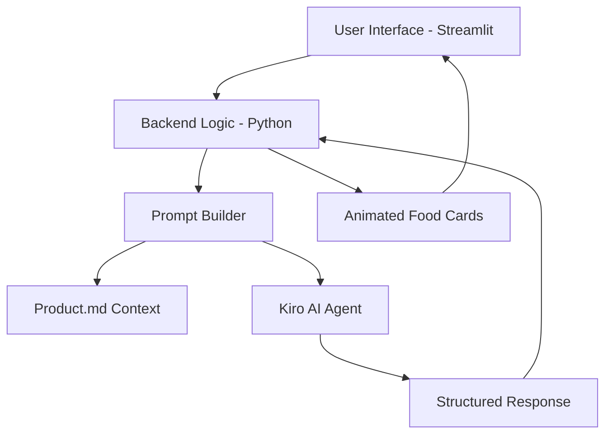

# 🍛 Delhi Street Food Recommender App

> Your AI-powered local guide to authentic Delhi street food, powered by Kiro AI

[](https://your-app-url.streamlit.app)
[](https://www.python.org/downloads/)
[](https://opensource.org/licenses/MIT)

## 📖 Overview

The Delhi Street Food Recommender App is an intelligent Streamlit application that provides authentic, local-style street food recommendations. Unlike generic AI responses, this app leverages a curated knowledge base of Delhi's street food scene and integrates with Kiro AI to deliver personalized suggestions that feel like they come from a local expert.

**Key Features:**
- 🎯 Personalized recommendations based on area, time, and budget
- 🗺️ Covers multiple Delhi localities with local insider knowledge
- ⏰ Time-aware suggestions (Morning, Afternoon, Evening, Late Night)
- 💰 Budget-conscious options (Budget-friendly, Mid-range, Premium)
- 🎨 Beautiful, animated UI with food cards
- 🔒 Strictly curated content - only recommends from verified local knowledge

## 🏗️ Architecture



## 🚀 Quick Start

### Prerequisites

- Python 3.8 or higher
- Kiro AI API credentials
- Git

### Installation

1. **Clone the repository**
   ```bash
   git clone https://github.com/Jatin-analyst/Street_Food_Recommneder_app
   cd delhi-street-food-app
   ```

2. **Create a virtual environment**
   ```bash
   python -m venv venv
   source venv/bin/activate  # On Windows: venv\Scripts\activate
   ```

3. **Install dependencies**
   ```bash
   pip install -r requirements.txt
   ```

4. **Set up environment variables**
   
   Create a `.env` file in the project root:
   ```env
   KIRO_API_KEY=your_kiro_api_key_here
   KIRO_API_URL=your_kiro_api_url_here
   ```

5. **Run the application**
   ```bash
   streamlit run app.py
   ```

The app will open in your browser at `http://localhost:8501`

## 📁 Project Structure

```
delhi-street-food-app/
├── app.py                    # Main Streamlit application
├── recommendation_engine.py  # Core recommendation logic
├── context_loader.py         # Product.md file handling
├── prompt_builder.py         # Kiro prompt construction
├── kiro_client.py           # Kiro API integration
├── product.md               # Local Delhi knowledge base
├── requirements.txt         # Python dependencies
├── .streamlit/
│   └── config.toml          # Streamlit configuration
├── tests/
│   ├── test_unit.py         # Unit tests
│   └── test_properties.py   # Property-based tests
└── README.md
```

## 🎯 How It Works

1. **User Input**: Select your area, preferred time, food preferences, and budget
2. **Context Loading**: The app loads curated local knowledge from `product.md`
3. **AI Processing**: Your query is sent to Kiro AI with complete local context
4. **Smart Recommendations**: Receive 3-5 personalized food suggestions
5. **Beautiful Display**: View recommendations in animated cards with local tips

### What Makes This Different?

- **No Generic AI Knowledge**: The app ONLY recommends from the curated `product.md` file
- **Local Expert Tone**: Responses feel like talking to a Delhi local
- **Complete Context**: Every query includes full local knowledge for accurate suggestions
- **Fallback Recommendations**: If your area has no matches, get nearby alternatives

## 🧪 Testing

The project uses a dual testing approach for comprehensive coverage:

### Unit Tests
```bash
pytest tests/test_unit.py -v
```

### Property-Based Tests
```bash
pytest tests/test_properties.py -v
```

**Testing Framework:**
- **pytest**: Unit test framework
- **Hypothesis**: Property-based testing library (100+ iterations per property)
- **Streamlit Testing**: UI component validation

### Core Properties Tested

1. **AI Knowledge Restriction**: Never recommends items not in `product.md`
2. **Complete Context Injection**: All queries include full local knowledge
3. **Response Structure**: All recommendations have required fields
4. **Input Validation**: Proper error handling for invalid inputs
5. **Context Integrity**: Proper loading of all data categories
6. **Area Synchronization**: UI areas match context exactly
7. **Hot Reloading**: Context updates without restart
8. **Fallback Behavior**: Alternative suggestions when needed
9. **Card Rendering**: Proper UI display with emojis
10. **Error Robustness**: Clear error messages for all failure modes

## 🔧 Configuration

### Streamlit Configuration

### Customizing the Knowledge Base

Edit `product.md` to add/update:
- New Delhi areas
- Street food items
- Price ranges
- Peak hours
- Hygiene notes
- Local tips

Changes are automatically reflected in the next query (hot reloading enabled).

## 📊 Features in Detail

### Area Coverage
- Connaught Place
- Chandni Chowk
- Karol Bagh
- Pitampura
- Rajouri Garden
- Lajpat Nagar
- South Extension
- And more...

### Time-Based Recommendations
- **Morning**: Breakfast options, chai stalls
- **Afternoon**: Lunch spots, quick bites
- **Evening**: Snacks, chaat corners
- **Late Night**: Dinner options, 24/7 favorites

### Budget Categories
- **Budget-friendly**: ₹50-150
- **Mid-range**: ₹150-300
- **Premium**: ₹300+

## 🤝 Contributing

Contributions are welcome! Please follow these steps:

1. Fork the repository
2. Create a feature branch (`git checkout -b feature/AmazingFeature`)
3. Commit your changes (`git commit -m 'Add some AmazingFeature'`)
4. Push to the branch (`git push origin feature/AmazingFeature`)
5. Open a Pull Request

### Development Guidelines

- Follow PEP 8 style guide
- Add unit tests for new features
- Add property tests for new behaviors
- Update documentation as needed
- Ensure all tests pass before submitting PR

## 🐛 Troubleshooting

### Common Issues

**App won't start:**
```bash
# Check Python version
python --version  # Should be 3.8+

# Reinstall dependencies
pip install -r requirements.txt --upgrade
```

**Kiro API errors:**
- Verify your API key in `.env` file
- Check API rate limits
- Ensure network connectivity

**Context not loading:**
- Verify `product.md` exists in project root
- Check markdown formatting
- Review error messages in console

## 📝 License

This project is licensed under the MIT License - see the [LICENSE](LICENSE) file for details.

## 👥 Authors

- **JATIN** - *Initial work* - [GitHub](https://github.com/Jatin-analyst/Street_Food_Recommneder_app)

## 🙏 Acknowledgments

- **Kiro AI** for the intelligent agent capabilities
- **Streamlit** for the amazing web framework
- **Delhi Street Food Community** for the local knowledge
- **Hypothesis** for property-based testing framework

## 📧 Contact

Have questions or suggestions? Reach out:

- **Email**: Jatinchd115@gmail.com or Jatincode8124@gmail.com

---

**Made with passion for Delhi** | **Powered by Kiro AI** | **Built with Streamlit**
